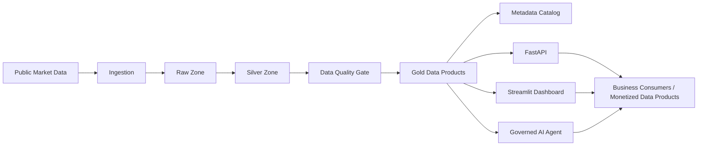

# Data Flow Architecture

## Purpose

The BMV Market Intelligence Platform is a local, Docker-based MVP that transforms public Mexican market data into AI-ready data products for Market Intelligence and data monetization.

It is not a trading system, investment recommender, or price prediction platform. Forecasting models are intentionally outside the current MVP and belong only to future roadmap phases after the governed data foundation is in place.

The platform demonstrates the full chain:

```text
Public Market Data -> Raw -> Silver -> Quality -> Gold -> Metadata -> API -> Governed AI Agent
```



## Scope

This MVP does not use BMV Web Services because those services require commercial access, credentials, controlled connectivity, and authorization processes that would make the assessment harder to reproduce.

Yahoo Finance is used through `yfinance` as the technical data source because it provides public historical daily prices without credentials. The business domain remains focused on Mexican market intelligence and BMV-related data products.

## Source Assessment

BMV was evaluated as the preferred official source for the MVP. The public BMV website exposes market tables and issuer statistics, but the public pages are designed mainly for current or delayed consultation rather than simple historical OHLCV downloads by issuer.

BMV also offers more complete market data products, including historical and closing information, but those are commercial information products distributed through controlled channels such as email, FTP, or authorized services. BMV Web Services also exist, including delayed issuer data, but they require user/password or token-based access.

Because of that, using BMV public pages directly would have limited the MVP in two ways:

- Public pages would provide current or delayed snapshots rather than an immediately available historical dataset.
- Building history from snapshots would require a scheduled collector running over time, for example every 20 minutes, and would still depend on page structure, access rules, and source availability.

For a reproducible technical assessment, the project uses Yahoo Finance as a public historical data source with similar issuer market data characteristics. This keeps the pipeline executable by any reviewer without paid BMV access while preserving the architecture needed to later replace the ingestion layer with authorized BMV feeds, databases, SFTP delivery, or Web Services in a production environment.

Reference sources reviewed:

- BMV issuer statistics pages: `https://www.bmv.com.mx/es/emisoras/estadisticas/`
- BMV information products and databases: `https://www.bmv.com.mx/es/productos-de-informacion/bases-de-datos`
- BMV Web Services documentation: `https://www.bmv.com.mx/work/models/Grupo_BMV/Resource/1996/6/images/web_services_190829.pdf`
- BMV database price list: `https://www.bmv.com.mx/work/models/Grupo_BMV/Resource/1192/10/images/LISTA%20DE%20PRECIOS%20BASES%20DE%20DATOS%202026.pdf`

## Runtime

The project runs locally through Docker Compose.

```bash
docker compose run --rm pipeline
```

The pipeline executes:

1. `src/ingestion/ingest_yfinance.py`
2. `src/transformation/build_silver.py`
3. `src/quality/validate_data_quality.py`
4. `src/gold/build_gold.py`
5. `src/metadata/build_metadata.py`

The API and dashboard runtime services run with:

```bash
docker compose up
```

## Layers

### Source

The ticker universe is configured in `config/tickers.json`.

The current universe includes representative Mexican issuers such as America Movil, Walmart de Mexico, Grupo Financiero Banorte, Grupo Mexico, Cemex, Grupo Bimbo, FEMSA, Coca-Cola FEMSA, Grupo Televisa, and Kimberly-Clark de Mexico.

The configured extraction window is five years of daily historical data.

### Raw

The Raw layer preserves the market price structure returned by the source.

Output:

```text
data/raw/market_prices_raw.parquet
data/raw/{ticker}.parquet
```

Main fields:

```text
date
ticker
open
high
low
close
adj_close
volume
```

### Silver

The Silver layer standardizes names, enforces types, enriches prices with issuer metadata, and adds derived fields.

Output:

```text
data/silver/market_prices_silver.parquet
```

Derived fields include:

```text
daily_return
intraday_volatility
price_range
volume_category
trend_flag
issuer_name
sector
ingestion_timestamp
```

Transformation highlights:

- Converts source-specific column names into business-readable fields such as `open_price`, `close_price`, and `adjusted_close`.
- Enforces date, ticker, price, and volume typing before downstream product generation.
- Sorts data by issuer and date to support time-series calculations.
- Calculates daily return, intraday volatility, and price range as reusable market signals.
- Classifies daily issuer movement as `Bullish`, `Bearish`, or `Neutral`.
- Categorizes volume by issuer into `Low`, `Medium`, and `High` activity bands.
- Enriches every market record with issuer name and sector metadata.
- Fails the pipeline if configured issuer metadata is missing.

This layer turns raw market observations into clean, enriched analytical records that can safely feed quality checks, Gold data products, dashboards, APIs, and AI responses.

### Data Quality

The quality layer validates Raw and Silver outputs before Gold data products are generated.

Output:

```text
data/metadata/data_quality_report.json
```

Implemented checks include:

- Raw and Silver row counts are greater than zero.
- Required Raw and Silver columns are present.
- Silver ticker and date are not null.
- Silver ticker-date records are unique.
- Prices and volume are non-negative.
- High price is greater than or equal to low price.
- Close price is between low and high when values are comparable.

### Gold

The Gold layer converts clean market data into reusable data products.

Output:

```text
data/gold/gold_performance.parquet
data/gold/gold_volatility.parquet
data/gold/gold_liquidity.parquet
data/gold/gold_market_trends.parquet
data/gold/gold_ai_insights.parquet
```

These datasets are designed for API consumption, dashboards, and grounded AI responses.

Gold transformation highlights:

- Computes 7-day, 30-day, and 90-day issuer returns for performance analysis.
- Computes rolling volatility windows to support risk classification.
- Builds daily issuer rankings for performance and liquidity.
- Calculates 30-day average, maximum, and minimum volume windows.
- Detects volume variation against recent issuer activity.
- Compares issuer returns against sector averages.
- Measures market participation within each sector.
- Converts quantitative signals into AI-ready insight titles, summaries, business interpretations, and recommended follow-up questions.

The Gold layer is intentionally shaped around business questions instead of generic tables. This makes the outputs easier to expose as APIs, dashboard sections, alerts, reports, and controlled AI answers.

### Metadata

The metadata layer catalogs every current dataset and describes its business use.

Output:

```text
data/metadata/datasets_metadata.json
```

Each metadata entry includes:

```text
dataset_name
layer
record_count
column_count
columns
created_at
source
business_description
path
```

### API

The FastAPI service exposes the Gold layer and metadata catalog.

Endpoints:

```text
GET /health
GET /datasets
GET /performance
GET /volatility
GET /liquidity
GET /market-trends
GET /ai-insights
GET /questions
POST /ask
POST /ask-llm
```

### Governed AI Agent

The platform exposes a hybrid governed AI layer:

- `POST /ask` uses a deterministic agent for supported, fully auditable market intelligence questions.
- `POST /ask-llm` uses an optional LLM-governed assistant. It retrieves structured context from Gold datasets first, then asks the model to write a concise answer from that evidence only.

The value is governance, traceability, and hallucination control: answers are generated only from curated Gold products, include supporting data points, and reject unsupported, out-of-domain, predictive, or advisory questions.

The AI layer is a natural-language access layer over governed Market Intelligence products. It is not designed to forecast prices, produce trading signals, or recommend investment actions.

Supported question families:

- Best 30-day performance.
- Sustained growth with controlled volatility.
- Sector volatility.
- Unusual volume behavior.
- Relevant market insights.
- Weakest 30-day performance.
- Highest liquidity.
- High-risk issuers.
- Strongest sectors by 30-day performance.
- Latest market snapshot.
- Single-issuer summaries.
- Two-issuer comparisons.

If the question is outside the supported scope, the deterministic agent returns suggested supported questions instead of inventing an answer. `GET /questions` exposes the current governed question set for API consumers and the dashboard.

The LLM-governed assistant does not use embeddings or external retrieval in this MVP. It uses structured retrieval over current Gold Parquet datasets:

- Ticker questions select latest issuer evidence across performance, volatility, liquidity, and trends.
- Sector questions aggregate latest issuer evidence by sector.
- Market questions build a compact packet with latest snapshot, top/bottom performers, liquidity, volatility, and AI-ready insights.

Model-backed answers require `OPENAI_API_KEY`. Without it, `/ask-llm` returns a controlled configuration message plus the evidence packet that would be sent to the model.

## Quality Gates

The automated test suite validates the key project contracts:

- Gold datasets are generated with expected columns and row counts.
- Metadata describes the current datasets.
- API endpoints return records.
- The deterministic agent answers supported questions and rejects unsupported questions.
- The LLM-governed assistant builds Gold evidence and rejects out-of-domain, predictive, and advisory questions before any model call.

Run:

```bash
docker compose run --rm tests
```
